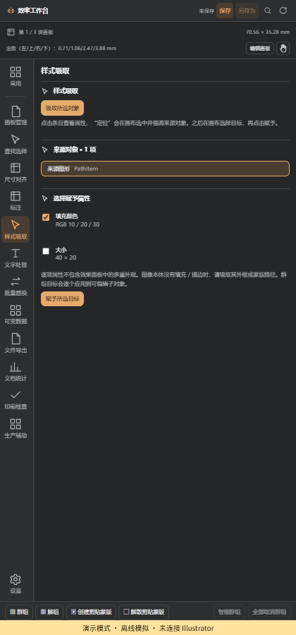
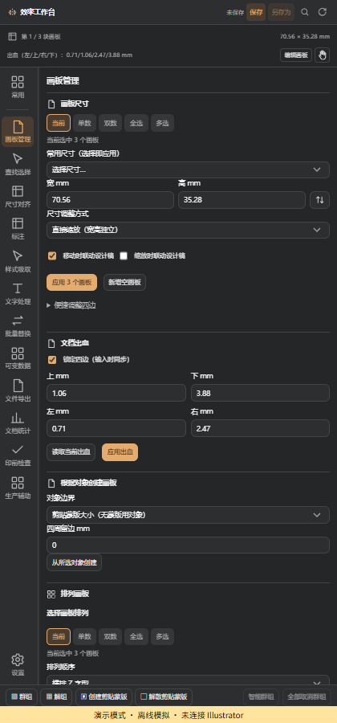

# Adobe Illustrator Workbench

**Adobe Illustrator 效率工作台**：中文模块化 Illustrator 面板，集中处理画板、选区、尺寸、文字、样式、批量输出与印前检查。当前版本 **0.6.39**。本项目为第三方插件，与 Adobe 官方产品发布无隶属关系。

[下载 Windows 安装包](https://github.com/sfex1320/Adobe-Illustrator-Workbench/releases/latest) · [安装说明](installer/README-INSTALL.md) · [本版改动与限制](docs/RELEASE-0.6.39.md)

下面为离线演示界面，示例对象不代表真实稿件；宿主验证另见版本记录。

| 样式吸取 | 画板命名与间距 |
|---|---|
|  |  |

## 兼容与安装

| 环境 | 状态 |
|---|---|
| Windows x64 + Illustrator 2026 **30.0.0** | 已进行真实宿主验证 |
| 其他 30.x 小版本 | 未逐版本验证，不能保证兼容 |
| Illustrator 2025 及更早版本 | 当前不支持 |
| macOS / Windows ARM 原生 | 当前没有安装包或实测支持 |

下载 `AIQ-Workbench-0.6.39-Setup.exe` 后双击。安装器识别注册的 Illustrator 30 安装目录，同时安装 CEP 面板与原生模块。Illustrator 正在运行时提交队列，正常退出后安装，再启动软件即可打开“窗口 → 扩展 → 效率工作台”。原生插件目录需要写权限；权限不足会报告失败并恢复旧版。EXE 尚无 Authenticode 签名，CEP 使用当前用户的开发扩展加载设置。具体路径、权限与卸载见安装说明。

## 功能

### 画板管理

创建画板、使用尺寸预设、适合选区、批量命名、按行列容量分块排列。画板工具的多选与面板显式勾选分别处理，不把空范围扩展成全部画板。尺寸调整保持画板中心；四边便捷调整支持上、下、左、右独立输入或锁定统一输入。文档出血可独立设置四边或统一设置，范围为每边 0–72 pt。出血是整个文档的设置，不是各画板独立出血。

联动设计稿可使用直接缩放、按宽/高等比及包含出血的缩放方式。嵌套剪贴蒙版按可见区域归属画板，跨画板根群组不拆散；文字与图片的归属仍以外框近似。

### 对象选择、尺寸与对齐

按类型、属性及文档资源查找并定位对象；支持明确的选区和文档范围。对象尺寸、整体选区尺寸、倍率、按宽或按高比例、九宫格定位、间距分布、参考对象对齐。普通边界及矩形蒙版可见边界直接测量，精确字形使用原生内存轮廓读取。智能群组与递归解组保护蒙版及叠放关系。

### 标注

对象尺寸、画板规格、四边标注、水平/垂直间隙和曲线长度；支持位置、单位、精度与样式设置。可关联对象群组并取消标注。曲线长度采用贝塞尔细分，文字和群组不冒充单一路径长度。

### 样式吸取（0.6.39）

选择来源后点击吸取，按对象层级列出可用属性；点击列表对象会在画布选中定位。勾选属性，再选择目标并点击赋予。群组和剪贴蒙版递归展示子对象及蒙版路径。

| 类型 | 当前可吸取/赋予 |
|---|---|
| 图形 | 纯色填充、填充开关、描边开关、描边颜色/粗细、宽高 |
| 文字 | 字体、字号、字符颜色、垂直缩放、统一文字属性、整体宽高、区域文字框大小 |
| 图像/路径图像 | 可用宽高；边框样式取其路径或剪贴蒙版，不把位图像素颜色当填充 |
| 群组/蒙版 | 逐项子对象属性与定位；群组尺寸与子对象样式分别应用 |

混合文字属性不会默取首字符；选定字符片段可以单独取样与赋予。渐变、图案、多重外观、效果、复杂字符混排复制尚不完整，会显示不可用项；一次取样上限 300 个对象，单个文本检查上限 5000 个字符。不会默认改变所有不支持的属性。

### 文字处理

查找替换、文字样式查询、按字符片段匹配字号/字体/颜色等属性、转曲、段落对齐与多行居中。逐项匹配可定位字符；跨多个文本框的“选择所有匹配文本框”是对象级选择，不冒充 Illustrator 不支持的跨框非连续字符高亮。

### 对象替换

记住目标 A，再选择一个或多个来源 B，批量替换并处理层级、尺寸与位置。来源与目标分开确认，避免选区改变造成目标串用。

### 文件导出与合集导出

按画板或对象输出 AI、SVG、EPS、PDF、PNG、JPG、TIF、PSD。提供命名、倍率、PPI、色彩用途、出血、文字转曲、PDF 兼容和支持格式的图层选项。源稿保护流程不自动保存用户原稿；必要时使用本批次拥有的工作副本。

AI 画板导出会剔除其他画板上的普通对象与群组子对象，再将跨边界内容限制在选定范围。合集导出支持多个画板/对象合为一个矢量文件，保留相对位置和叠放顺序。AI 画板合集保留多个选定画板；PDF/SVG/EPS 为一张联合页面，画板间隙保持空白。

串接文字为避免重排可能保留被蒙版隐藏的编辑内容；本功能不是敏感内容清除工具。大图、印刷色及非原生条件可能需要独立渲染组件；组件缺少时明确失败，不降采样冒充完成。RGB→CMYK 的原生 TIFF 路径已停用，改走独立渲染。

### 打包

收集 AI、可取得的字体、链接与画板附件，提供来源说明及未完成项。字体属性读取失败、缺失链接、受限字体或扫描预算不足会标记部分完成，不承诺取得所有字体。用户输出 AI 的 PDF 兼容开关保持独立。

### 文档统计与印前检查

统计字体家族/款式/字号、使用颜色、色板和渐变，支持由条目查找对象。印前检查覆盖当前已支持的未转曲文字、RGB 印刷色、专色、未使用色板、隐藏锁定对象等；无法解析内容与预算内未扫描部分明确列出，不计作零或通过。

### 生产辅助与可变数据

蒙版内图片填满/适合/按宽高等比；多画板同位置复制；单行点文字基线对齐；碎文字合并；流水号、页码、画板命名；Code 128/EAN-13 条码；链接图像 Photoshop 往返。文字溢出检查可用，可靠的自动适配仍未开放。

可变数据支持表格列绑定模板文字、图片和二维码并生成变化稿。对称整理保留已实现的副本/反射能力；实时裁切、融合和自动更新尚未完成，不以一次反射代替实时对称。

### 工作台与设置

深色/浅色/跟随宿主、六档字号、可调侧栏、左右停靠、锁定和自动折叠；模块启停影响入口与执行；设置导入导出 ZIP/.aiqsettings；当前文档标尺单位；输入首次获焦全选、数值草稿及统一格式。自动同步只在返回面板时合并单次读取，不定时轮询 Illustrator。

设置新增手动检查更新、查看版本和安装更新。支持 GitHub 直连及用户填写的 HTTPS 镜像前缀。更新清单使用项目 RSA 签名，包大小、SHA-256 和解压路径均校验；安装进入同一退出等待队列。镜像须支持 GitHub Release 重定向，不内置第三方镜像，也不保证每个国内网络可达。

## 已知问题与下一步

- 本轮测试曾遇到 Illustrator 宿主崩溃：RGB→CMYK 原生 TIFF 已隔离；另一次 AI 重开访问冲突在冷启动后没有复现，根因未证实解决。详见版本记录。
- 0.6.39 新面板的真实 CEP 冷启动、完整点击更新流程及更多 Illustrator 小版本仍需验证；浏览器模拟与宿主命令验证分别报告。
- 下一步优先处理宿主稳定性、串接文字的独立画板拆分、渐变/多重外观取样、更新回滚入口与镜像连通性诊断。
- 原生关键对象完整激活顺序、画板与图层绑定、可靠文字适配、实时对称仍有缺口。
- 当前 npm 审计报告 exceljs 的间接 uuid 依赖共2项中等级别告警；自动修复建议涉及 exceljs 主版本变化，尚未实施。应在表格导入兼容回归中处理，不能视为已修复。

## 源码与构建

TypeScript / React / Vite + ExtendScript + Windows C++ 原生模块。Node.js 建议 22.12+，单一 npm lockfile。

```powershell
npm ci
npm run build
npm test -- tests/artboard-edges-v0639.spec.ts tests/updater-v0639.spec.ts
```

`npm run dev` 是持续标注“演示模式”的浏览器开发环境，不证明 Illustrator 能力。`apps/panel` 为界面，`packages/core` 为调度与业务契约，`packages/modules` 为功能模块，`host/cep` 为宿主桥接，`host/native`、`host/raster`、`host/windows-picker` 为 Windows 组件，`installer` 为安装更新。

Windows 原生构建需要 VS 2022 C++ v143、Windows SDK 与自行取得的 Adobe SDK；SDK 和签名私钥不在仓库。外置 SDK 通过 `scripts/build-native.ps1 -SdkRoot <SDK目录>` 指定。独立渲染组件见 `host/raster`。正式打包有真实宿主证据门禁，公共仓库不附带含本机路径或设计稿的历史验收原始材料；没有重新取得验收证据时不能仅凭前端构建宣称可发布。可直接使用 Releases 的已构建文件。

第三方代码遵循各自许可，见包内 THIRD-PARTY-NOTICES。公开源码不表示 Adobe SDK 或用户设计稿可再分发；本仓库不包含它们。
